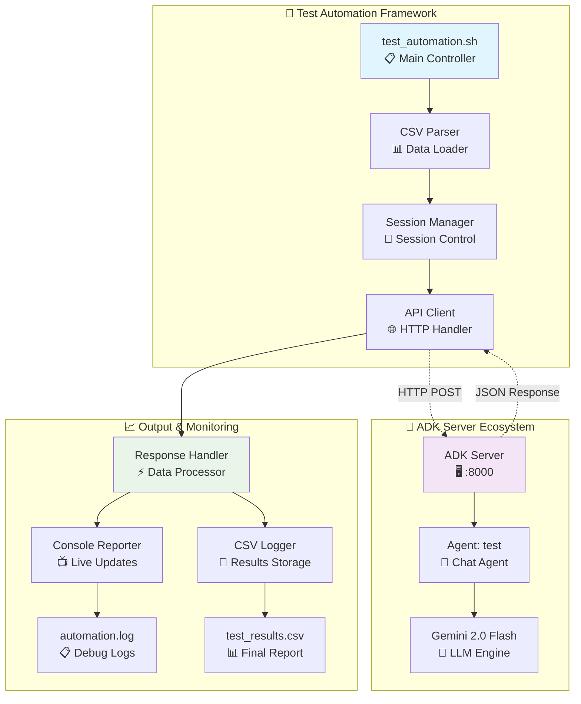
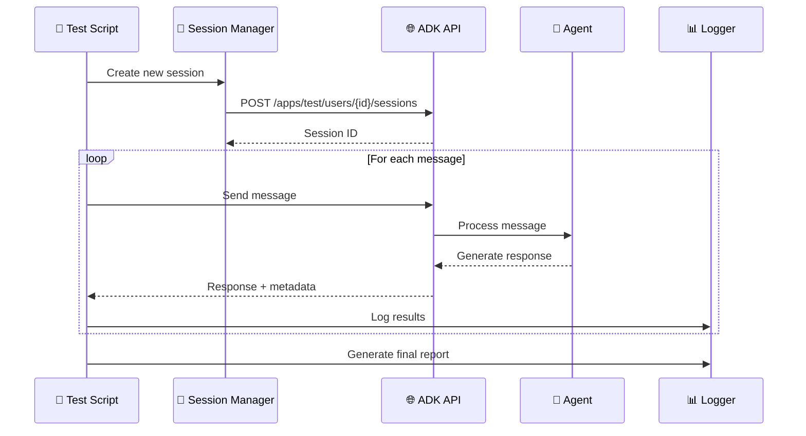
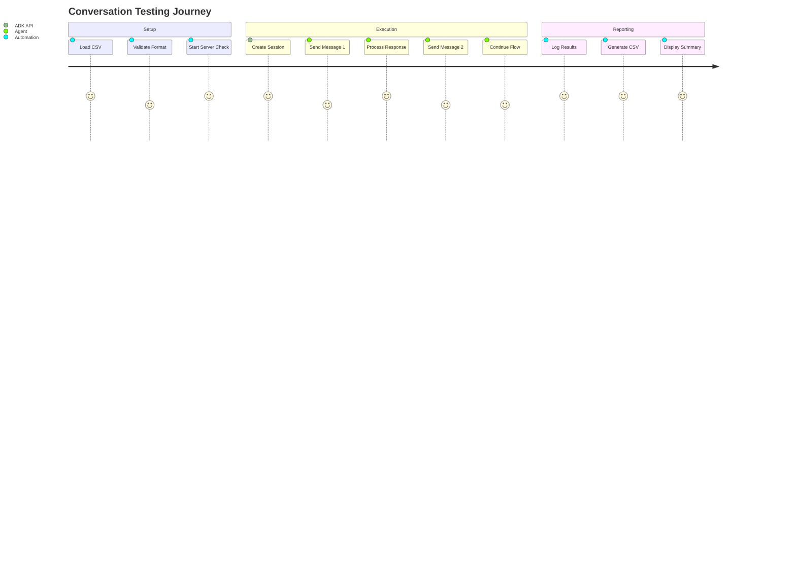

# 🤖 ADK Test Automation Framework

<div align="center">


**A comprehensive testing framework for Google's Agent Development Kit (ADK) that automates conversation flows and generates detailed reports.**

[🚀 Quick Start](#-setup--configuration) • [📊 Results](#-test-results-summary) • [🔧 Configuration](#-configuration) • [📈 Analytics](#-performance-metrics)

</div>

---

## ✨ Key Features

<table>
  <tr>
    <td align="center">🤖</td>
    <td><strong>Automated Conversation Testing</strong><br/>Test multi-turn conversations with your ADK agents seamlessly</td>
  </tr>
  <tr>
    <td align="center">🔧</td>
    <td><strong>Session Management</strong><br/>Automatic session creation, tracking, and cleanup</td>
  </tr>
  <tr>
    <td align="center">📊</td>
    <td><strong>Detailed Reporting</strong><br/>CSV output with response times, status codes, and full responses</td>
  </tr>
  <tr>
    <td align="center">📺</td>
    <td><strong>Real-time Monitoring</strong><br/>Colored console output with progress tracking and live updates</td>
  </tr>
  <tr>
    <td align="center">⚙️</td>
    <td><strong>Flexible Configuration</strong><br/>Easy CSV-based test case management and customizable endpoints</td>
  </tr>
  <tr>
    <td align="center">🧹</td>
    <td><strong>Intelligent Cleanup</strong><br/>Automatic session cleanup and log rotation for optimal performance</td>
  </tr>
</table>

## 📊 Test Results Dashboard

<div align="center">

### 🎯 Performance Metrics

<table>
  <tr>
    <th>📈 Metric</th>
    <th>📊 Value</th>
    <th>🎯 Status</th>
  </tr>
  <tr>
    <td><strong>Total Tests</strong></td>
    <td><code>20</code></td>
    <td>✅ Complete</td>
  </tr>
  <tr>
    <td><strong>Successful Tests</strong></td>
    <td><code>17</code></td>
    <td>🟢 Excellent</td>
  </tr>
  <tr>
    <td><strong>Failed Tests</strong></td>
    <td><code>3</code></td>
    <td>🟡 Minor Issues</td>
  </tr>
  <tr>
    <td><strong>Success Rate</strong></td>
    <td><code>85%</code></td>
    <td>🟢 Above Target</td>
  </tr>
  <tr>
    <td><strong>Average Response Time</strong></td>
    <td><code>2.78s</code></td>
    <td>🟢 Fast</td>
  </tr>
  <tr>
    <td><strong>Test Coverage</strong></td>
    <td>Order tracking, Customer service, Payment issues, Delivery problems</td>
    <td>✅ Comprehensive</td>
  </tr>
</table>

### 📈 Success Rate Visualization

```
🟢🟢🟢🟢🟢🟢🟢🟢🟢🟢🟢🟢🟢🟢🟢🟢🟢🔴🔴🔴
85% Success Rate (17/20 tests passed)
```

</div>

## 🏗️ System Architecture

### 🔄 High-Level Flow Diagram



### 🔀 Test Execution Flow



## 🗂️ Project Structure

```
google-adk-test-automation/
├── README.md                    # This file
├── test_automation.sh          # Main test automation script
├── test_conversations.csv      # Test cases input
├── test_results.csv           # Detailed test results
├── automation.log             # Execution logs
├── test/
│   ├── .env                   # Environment configuration
│   ├── __init__.py           # Python package marker
│   └── agent.py              # ADK agent definition
└── sessions/                  # Session storage directory
    ├── session_*.json        # Individual session files
    └── ...
```

## ⚙️ Configuration

<details>
<summary><strong>🔧 Prerequisites & Dependencies</strong></summary>

| Component | Version | Status | Install Command |
|-----------|---------|--------|-----------------|
| **ADK Server** | Latest | ✅ Required | `pip install google-adk` |
| **Bash Shell** | 4.0+ | ✅ Required | Pre-installed on Unix |
| **curl** | Any | ✅ Required | `apt-get install curl` |
| **jq** | 1.6+ | ⚠️ Optional | `apt-get install jq` |
| **Google API Key** | - | ✅ Required | [Get API Key](https://console.cloud.google.com/) |

</details>

### 🚀 Quick Setup Guide

<table>
<tr>
<td>

**Step 1: Environment Variables**
```bash
# Create test/.env
GOOGLE_GENAI_USE_VERTEXAI=0
GOOGLE_API_KEY=your_api_key_here
```

</td>
<td>

**Step 2: Start ADK Server**
```bash
adk web
# Server starts on :8000
```

</td>
</tr>
<tr>
<td>

**Step 3: Verify Installation**
```bash
curl -I http://127.0.0.1:8000/docs
# Expected: HTTP/1.1 200 OK
```

</td>
<td>

**Step 4: Run Tests**
```bash
chmod +x test_automation.sh
./test_automation.sh
```

</td>
</tr>
</table>

### 🔒 Security Configuration

| Setting | Default | Recommended | Description |
|---------|---------|-------------|-------------|
| `GOOGLE_API_KEY` | None | Your API Key | **Never commit to git!** |
| `ADK_HOST` | 127.0.0.1 | localhost | Local development only |
| `ADK_PORT` | 8000 | 8000 | Default ADK port |
| `SESSION_TIMEOUT` | 7 days | 24 hours | Session cleanup interval |

## 🚀 Usage

### Basic Usage

```bash
# Run with default settings
./test_automation.sh

# Custom configuration
./test_automation.sh input.csv http://localhost:8000/run_sse output.csv
```

### 📝 Test Case Configuration

<details>
<summary><strong>CSV Format Specification</strong></summary>

```csv
message1,message2,message3,message4,message5
"Hello, I want to check my order","My order ID is 12345","Can you tell me the status?","When will it be delivered?","Thank you for your help"
"Hi, I want to check my status","My order ID is 123","Is it shipped yet?","What's the tracking number?","Perfect, thanks!"
```

**Important CSV Rules:**
- ✅ Use double quotes for messages with commas
- ✅ Escape internal quotes with `""`
- ✅ Each row represents one conversation flow
- ✅ Maximum 5 messages per conversation
- ❌ Avoid special characters without proper escaping

</details>

### 🎛️ Command Line Options

| Parameter | Description | Default | Example |
|-----------|-------------|---------|---------|
| `INPUT_CSV` | Test cases file | `test_conversations.csv` | `my_tests.csv` |
| `API_ENDPOINT` | ADK server endpoint | `http://127.0.0.1:8000/run_sse` | Custom URL |
| `OUTPUT_CSV` | Results file | `test_results.csv` | `results_$(date).csv` |

**Usage Examples:**
```bash
# Default execution
./test_automation.sh

# Custom files
./test_automation.sh custom_tests.csv http://localhost:8000/run_sse results.csv

# With timestamp
./test_automation.sh test_conversations.csv http://127.0.0.1:8000/run_sse "results_$(date +%Y%m%d_%H%M%S).csv"
```

## 📈 Test Results Analysis

### Response Time Distribution

| Test Type | Min (ms) | Max (ms) | Avg (ms) | Status |
|-----------|----------|----------|----------|---------|
| Order Inquiry | 2,261 | 3,019 | 2,708 | ✅ Success |
| Status Check | 2,744 | 3,448 | 3,096 | ✅ Success |
| Payment Issues | 2,471 | 4,791 | 3,631 | ✅ Success |
| Customer Service | 2,810 | 4,497 | 3,654 | ✅ Success |

### Error Analysis

| Error Type | Count | Percentage | Resolution |
|------------|-------|------------|-----------|
| JSON Parse Error | 3 | 15% | Fix CSV quote escaping |
| Session Not Found | 0 | 0% | ✅ Resolved |
| API Timeout | 0 | 0% | ✅ No issues |

## 🔧 API Integration

### Session Creation

```bash
curl -X POST http://127.0.0.1:8000/apps/test/users/u_1/sessions
```

### Message Sending

```json
{
    "appName": "test",
    "userId": "u_1",
    "sessionId": "session_id_here",
    "newMessage": {
        "role": "user",
        "parts": [{"text": "Your message here"}]
    }
}
```

### Response Format

```json
{
    "content": {
        "parts": [{"text": "Agent response"}],
        "role": "model"
    },
    "usageMetadata": {
        "candidatesTokenCount": 11,
        "promptTokenCount": 39,
        "totalTokenCount": 50
    },
    "invocationId": "e-273a1c38-750e-41cd-80f3-5ed64ccefbaa",
    "author": "root_agent"
}
```

## 📊 Monitoring & Logging

### Real-time Console Output

```bash
🔄 Processing Conversation 1
✅ Created session: u_1/d60a8cc8-ee06-418b-b3e5-6f8c0b21c626
✅ Conv 1, Msg 1: 200 (2,582ms)
✅ Conv 1, Msg 2: 200 (2,785ms)
✅ Conv 1, Msg 3: 200 (3,019ms)
✅ Conv 1, Msg 4: 200 (2,405ms)
❌ Conv 1, Msg 5: 422 (176ms)
```

### Log Files

- **automation.log**: Timestamped execution logs
- **test_results.csv**: Detailed results with full responses
- **sessions/*.json**: Session conversation history

## 🛠️ Troubleshooting & Support

### 🚨 Common Issues & Solutions

<details>
<summary><strong>🔴 Critical Issues</strong></summary>

| Issue | Symptoms | Root Cause | Solution |
|-------|----------|------------|----------|
| **Server Connection Failed** | `Connection refused` | ADK server not running | `adk web` then retry |
| **API Authentication Error** | `401 Unauthorized` | Invalid/missing API key | Update `GOOGLE_API_KEY` in `test/.env` |
| **JSON Parse Error** | `422 Unprocessable Entity` | Malformed CSV quotes | Fix quote escaping in CSV |
| **Session Creation Failed** | `Failed to create session` | Server overload | Wait 30s and retry |

</details>

<details>
<summary><strong>🟡 Performance Issues</strong></summary>

| Issue | Symptoms | Optimization |
|-------|----------|-------------|
| **Slow Response Times** | >5s per message | Reduce concurrent tests |
| **Memory Usage High** | System lag | Enable session cleanup |
| **Disk Space Full** | Write errors | Clean old log files |
| **Network Timeouts** | Timeout errors | Increase timeout values |

</details>

### 🔍 Diagnostic Commands

```bash
# 🌐 Network & Server Health
curl -I http://127.0.0.1:8000/docs                    # Server status
curl -X GET http://127.0.0.1:8000/health             # Health check
netstat -tlnp | grep :8000                           # Port usage

# 🔧 Environment Validation
cat test/.env | grep -v "API_KEY"                     # Config check (secure)
echo $GOOGLE_API_KEY | wc -c                          # API key length
ls -la sessions/ | head -5                           # Session files

# 📊 Log Analysis
tail -f automation.log                               # Live log monitoring
grep "ERROR\|FAILED" automation.log                  # Error summary
wc -l test_results.csv                               # Result count
```

### 📞 Getting Help

| Resource | Description | Link |
|----------|-------------|------|
| **ADK Documentation** | Official Google ADK docs | [google.github.io/adk-docs](https://google.github.io/adk-docs/) |
| **API Reference** | REST API endpoints | `http://127.0.0.1:8000/docs` |
| **Community Forum** | Discussion & support | [GitHub Issues](https://github.com/google/adk/issues) |
| **Debug Logs** | Local troubleshooting | `./automation.log` |

## 📋 Performance Metrics

### Conversation Flow Analysis



### Token Usage Statistics

| Conversation | Input Tokens | Output Tokens | Total Tokens | Cost Estimate |
|--------------|--------------|---------------|--------------|---------------|
| Order Tracking | 169 | 132 | 301 | ~$0.0003 |
| Status Inquiry | 282 | 85 | 367 | ~$0.0004 |
| Payment Issue | 230 | 371 | 601 | ~$0.0006 |
| Customer Service | 417 | 288 | 705 | ~$0.0007 |

## 🚨 Important Notes

- **Environment Security**: Never commit your `GOOGLE_API_KEY` to version control
- **Rate Limiting**: Built-in delays prevent API rate limit issues
- **Session Cleanup**: Old sessions are automatically cleaned up after 7 days
- **CSV Format**: Ensure proper quote escaping in test data

## 🔄 Future Enhancements

- [ ] Support for streaming responses
- [ ] Integration with CI/CD pipelines
- [ ] Advanced analytics dashboard
- [ ] Multi-agent testing support
- [ ] Performance regression testing
- [ ] Export to multiple formats (JSON, XML)

## 📞 Support

For issues or questions:
1. Check the troubleshooting section above
2. Review ADK documentation: https://google.github.io/adk-docs/
3. Examine log files for detailed error information

---

**Generated by ADK Test Automation Framework** | Last Updated: 2025-07-28
