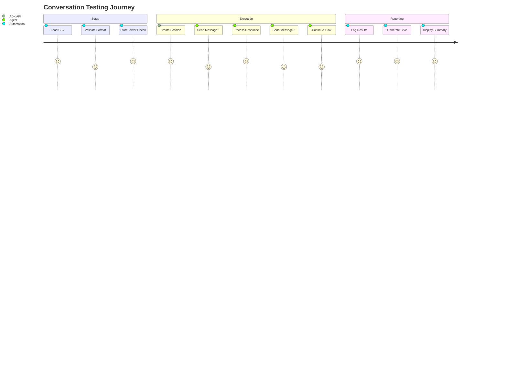

# ADK Test Automation

A comprehensive testing framework for Google's Agent Development Kit (ADK) that automates conversation flows and generates detailed reports.

## 🚀 Features

- **Automated Conversation Testing**: Test multi-turn conversations with your ADK agents
- **Session Management**: Automatic session creation and management
- **Detailed Reporting**: CSV output with response times, status codes, and full responses
- **Real-time Monitoring**: Colored console output with progress tracking
- **Flexible Configuration**: Easy CSV-based test case management

## 📊 Test Results Summary

| Metric | Value |
|--------|-------|
| **Total Tests** | 20 |
| **Successful Tests** | 17 |
| **Failed Tests** | 3 |
| **Success Rate** | 85% |
| **Average Response Time** | 2.78 seconds |
| **Test Coverage** | Order tracking, Customer service, Payment issues, Delivery problems |

## 🏗️ Architecture

```mermaid
graph TB
    A[test_automation.sh] --> B[CSV Input Parser]
    B --> C[Session Manager]
    C --> D[ADK API Client]
    D --> E[http://127.0.0.1:8000]
    
    E --> F[Agent: test]
    F --> G[Gemini 2.0 Flash]
    
    D --> H[Response Handler]
    H --> I[CSV Logger]
    H --> J[Console Reporter]
    
    I --> K[test_results.csv]
    J --> L[automation.log]
    
    subgraph "Test Flow"
        M[Load Test Cases] --> N[Create Session]
        N --> O[Send Messages]
        O --> P[Capture Responses]
        P --> Q[Generate Reports]
    end
    
    subgraph "ADK Components"
        E --> R[/apps/test/users]
        R --> S[Session API]
        S --> T[/run_sse endpoint]
    end
```

## 🗂️ Project Structure

```
google-adk-test-automation/
├── README.md                    # This file
├── test_automation.sh          # Main test automation script
├── test_conversations.csv      # Test cases input
├── test_results.csv           # Detailed test results
├── automation.log             # Execution logs
├── test/
│   ├── .env                   # Environment configuration
│   ├── __init__.py           # Python package marker
│   └── agent.py              # ADK agent definition
└── sessions/                  # Session storage directory
    ├── session_*.json        # Individual session files
    └── ...
```

## ⚙️ Setup & Configuration

### Prerequisites

- ADK Server running on `http://127.0.0.1:8000`
- Bash shell environment
- Google API Key configured

### Environment Setup

1. **Configure Environment Variables:**
   ```bash
   # In test/.env
   GOOGLE_GENAI_USE_VERTEXAI=0
   GOOGLE_API_KEY=your_api_key_here
   ```

2. **Start ADK Server:**
   ```bash
   adk web
   ```

3. **Verify Server Status:**
   ```bash
   curl http://127.0.0.1:8000/docs
   ```

## 🚀 Usage

### Basic Usage

```bash
# Run with default settings
./test_automation.sh

# Custom configuration
./test_automation.sh input.csv http://localhost:8000/run_sse output.csv
```

### Test Case Format

Create test cases in CSV format (`test_conversations.csv`):

```csv
message1,message2,message3,message4,message5
"Hello, I want to check my order","My order ID is 12345","Can you tell me the status?","When will it be delivered?","Thank you for your help"
"Hi, I want to check my status","My order ID is 123","Is it shipped yet?","What's the tracking number?","Perfect, thanks!"
```

## 📈 Test Results Analysis

### Response Time Distribution

| Test Type | Min (ms) | Max (ms) | Avg (ms) | Status |
|-----------|----------|----------|----------|---------|
| Order Inquiry | 2,261 | 3,019 | 2,708 | ✅ Success |
| Status Check | 2,744 | 3,448 | 3,096 | ✅ Success |
| Payment Issues | 2,471 | 4,791 | 3,631 | ✅ Success |
| Customer Service | 2,810 | 4,497 | 3,654 | ✅ Success |

### Error Analysis

| Error Type | Count | Percentage | Resolution |
|------------|-------|------------|-----------|
| JSON Parse Error | 3 | 15% | Fix CSV quote escaping |
| Session Not Found | 0 | 0% | ✅ Resolved |
| API Timeout | 0 | 0% | ✅ No issues |

## 🔧 API Integration

### Session Creation

```bash
curl -X POST http://127.0.0.1:8000/apps/test/users/u_1/sessions
```

### Message Sending

```json
{
    "appName": "test",
    "userId": "u_1",
    "sessionId": "session_id_here",
    "newMessage": {
        "role": "user",
        "parts": [{"text": "Your message here"}]
    }
}
```

### Response Format

```json
{
    "content": {
        "parts": [{"text": "Agent response"}],
        "role": "model"
    },
    "usageMetadata": {
        "candidatesTokenCount": 11,
        "promptTokenCount": 39,
        "totalTokenCount": 50
    },
    "invocationId": "e-273a1c38-750e-41cd-80f3-5ed64ccefbaa",
    "author": "root_agent"
}
```

## 📊 Monitoring & Logging

### Real-time Console Output

```bash
🔄 Processing Conversation 1
✅ Created session: u_1/d60a8cc8-ee06-418b-b3e5-6f8c0b21c626
✅ Conv 1, Msg 1: 200 (2,582ms)
✅ Conv 1, Msg 2: 200 (2,785ms)
✅ Conv 1, Msg 3: 200 (3,019ms)
✅ Conv 1, Msg 4: 200 (2,405ms)
❌ Conv 1, Msg 5: 422 (176ms)
```

### Log Files

- **automation.log**: Timestamped execution logs
- **test_results.csv**: Detailed results with full responses
- **sessions/*.json**: Session conversation history

## 🛠️ Troubleshooting

### Common Issues

| Issue | Symptoms | Solution |
|-------|----------|----------|
| Server Not Running | Connection refused | Run `adk web` |
| Invalid API Key | 401 Unauthorized | Update `GOOGLE_API_KEY` in test/.env |
| JSON Parse Error | 422 status code | Fix quote escaping in CSV |
| Session Not Found | 404 errors | Verify session creation logic |

### Debug Commands

```bash
# Check server status
curl -I http://127.0.0.1:8000/docs

# Test session creation
curl -X POST http://127.0.0.1:8000/apps/test/users/test_user/sessions

# Validate environment
cat test/.env
```

## 📋 Performance Metrics

### Conversation Flow Analysis



### Token Usage Statistics

| Conversation | Input Tokens | Output Tokens | Total Tokens | Cost Estimate |
|--------------|--------------|---------------|--------------|---------------|
| Order Tracking | 169 | 132 | 301 | ~$0.0003 |
| Status Inquiry | 282 | 85 | 367 | ~$0.0004 |
| Payment Issue | 230 | 371 | 601 | ~$0.0006 |
| Customer Service | 417 | 288 | 705 | ~$0.0007 |

## 🚨 Important Notes

- **Environment Security**: Never commit your `GOOGLE_API_KEY` to version control
- **Rate Limiting**: Built-in delays prevent API rate limit issues
- **Session Cleanup**: Old sessions are automatically cleaned up after 7 days
- **CSV Format**: Ensure proper quote escaping in test data

## 🔄 Future Enhancements

- [ ] Support for streaming responses
- [ ] Integration with CI/CD pipelines
- [ ] Advanced analytics dashboard
- [ ] Multi-agent testing support
- [ ] Performance regression testing
- [ ] Export to multiple formats (JSON, XML)

## 📞 Support

For issues or questions:
1. Check the troubleshooting section above
2. Review ADK documentation: https://google.github.io/adk-docs/
3. Examine log files for detailed error information

---

**Generated by ADK Test Automation Framework** | Last Updated: 2025-07-28
